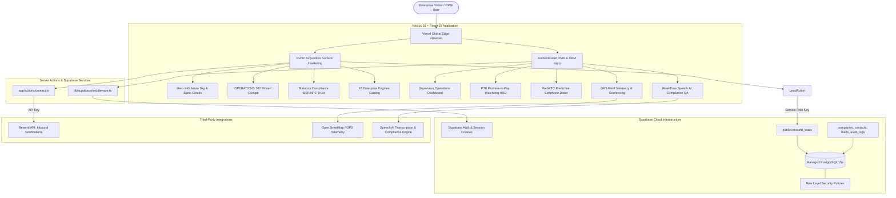

# BITS — Boundless IT Solutions
> **Sovereign Enterprise Operations Management System (OMS) & Collections CRM**  
> Sub-350ms predictive dialing, automated PTP promise tracking, GPS field telemetry, and speech AI compliance with zero per-seat licensing fees.

[](https://nextjs.org/)
[](https://react.dev/)
[](https://www.typescriptlang.org/)
[](https://tailwindcss.com/)
[](https://supabase.com/)
[](https://playwright.dev/)

---

> [!IMPORTANT]
> **Complete Internal Engineering & Architecture Manual**  
> For the exhaustive 500+ line specification, deep-dive database schema, API key policies, brand design tokens, and developer guidelines, read:  
> 📖 **[docs/FULL_SYSTEM_DOCUMENTATION.md](./docs/FULL_SYSTEM_DOCUMENTATION.md)**

---

## 📌 Table of Contents
1. [Executive Overview & The Problem We Solve](#-executive-overview--the-problem-we-solve)
2. [High-Level System Architecture](#-high-level-system-architecture)
3. [Technology Stack & Core Dependencies](#-technology-stack--core-dependencies)
4. [Supabase & Database Infrastructure](#-supabase--database-infrastructure)
5. [Environment Variables & API Keys](#-environment-variables--api-keys)
6. [The 4 Product Families & 18 Enterprise Engines](#-the-4-product-families--18-enterprise-engines)
7. [User Personas & Role-Based Access Control](#-user-personas--role-based-access-control)
8. [Brandbook, Glassmorphism & Cloud Design System](#-brandbook-glassmorphism--cloud-design-system)
9. [Component Architecture & Directory Map](#-component-architecture--directory-map)
10. [Developer Quickstart & Verification Suite](#-developer-quickstart--verification-suite)
11. [Project Documentation Directory](#-project-documentation-directory)

---

## 🏢 Executive Overview & The Problem We Solve

### The Problem
Traditional collections agency floors and high-velocity field operations in Southeast Asia suffer from massive efficiency and compliance drains:
1. **Spreadsheet Chaos & Broken PTPs**: Over 40% of promises-to-pay are dropped because tracking lives in fragmented spreadsheets, causing 4–7 day re-allocation delays.
2. **Telephony Dead-Air**: Outdated PBX systems waste 45 minutes of every hour on manual dialing and ringing tones.
3. **Ghost Field Visits & Fabricated Mileage**: Un-geotagged paper check-in sheets lead to false travel reimbursements and uncollectible debts.
4. **Regulatory Fines & License Risk**: Unmonitored collectors risk violating Bangko Sentral ng Pilipinas (**BSP Circulars 454 & 857**) and **NPC RA 10173 (Data Privacy)**.
5. **The SaaS Per-Seat Tax**: Foreign CRM providers charge $150–$300/seat/month, draining agency operating margins.

### The BITS Solution
- **OPERATIONS 360 (OMS)**: Unified collections CRM, predictive WebRTC dialing, GPS field enforcement, and speech AI compliance in a single sovereign platform.
- **Sub-350ms Predictive Pacing**: Connects live debtors to agents instantly, tripling daily talk time.
- **10-Second Promise Watchdog**: Automated PTP monitoring that reallocates accounts the moment a payment window expires.
- **100% Speech AI Compliance**: Acoustic and semantic screening verifying 100% of calls against anti-harassment rules.
- **Zero Per-Seat Licensing**: Flat enterprise licensing with 100% sovereign Philippine data residency.

---

## 📐 High-Level System Architecture



---

## 💻 Technology Stack & Core Dependencies

| Layer | Framework / Library | Exact Version | Purpose & Architecture Role |
|---|---|---|---|
| **Framework** | Next.js (App Router) | `16.3.8` | Turbopack engine, React Server Components (RSC), SSR, and API endpoints. |
| **Runtime** | React | `19.3.0` | React 19 primitives, Server Actions, concurrent state transitions. |
| **Language** | TypeScript | `7.0.2` | Strict type checking (`npx tsc --noEmit`), zero type-coercion bypasses. |
| **Styling** | Tailwind CSS | `4.3.3` | Tailwind v4 engine using native `@theme` CSS tokens in `app/globals.css`. |
| **Motion** | Motion (Framer Motion) | `13.2.0` | Physics-based micro-interactions, modal popovers, and interactive layout springs. |
| **Scroll Engine** | GSAP & ScrollTrigger | `3.15.0` | High-precision interactive pinned timeline scrubbing in `HeroProduct`. |
| **Database & Auth** | Supabase SSR & JS | `@supabase/ssr@0.12.7`<br>`@supabase/supabase-js@2.117.1` | PostgreSQL pooling, Row Level Security (RLS), and cookie session authentication. |
| **Validation** | Zod | `4.6.2` | Runtime request body validation, schema sanitization for lead intake. |
| **Charts & HUD** | Hand-authored inline SVG | — | Operations recovery velocity, talk-time averages, and floor metrics are drawn directly as SVG with CSS-var-driven gradients (see `components/sections/product-showcase.tsx`). **No charting library is installed** — `recharts` was declared but never imported, and was removed on 10 Oct 2026 (`SYSTEM_AUDIT.md` §41) |
| **Icons** | Lucide React | `1.45.0` | Clean, modern vector icons with consistent stroke weights. |
| **Testing** | Playwright | `1.63.0` | Headless multi-device responsive validation across 11 viewports. |

> Every package in this table is referenced by the source. `npm run` has no
> unused-dependency gate; `node scripts/unused-deps.mjs` checks it, including
> peer dependencies that are required without ever being imported.

---

## 🗄️ Supabase & Database Infrastructure

BITS utilizes **Supabase (Managed PostgreSQL 15+)** for secure data persistence, role-based access control, and real-time event streaming.

### Connection Details
- **Project URL**: `https://jvseyttzlobelrnzmfyf.supabase.co`
- **Dashboard**: [https://supabase.com/dashboard/project/jvseyttzlobelrnzmfyf](https://supabase.com/dashboard/project/jvseyttzlobelrnzmfyf)
- **Region**: Southeast Asia (Singapore / Sovereign low-latency cluster)

### Database Tables & Schemas

#### Table: `public.inbound_leads`
Captures high-intent enterprise consultation requests and contact form submissions.
```sql
create table if not exists public.inbound_leads (
  id                uuid primary key default gen_random_uuid(),
  name              text not null,
  email             text not null,
  company           text not null,
  company_size      text,
  industry          text,
  current_system    text,
  primary_challenge text,
  preferred_method  text,
  interest          text,
  message           text not null,
  source            text not null default 'Website Contact Form',
  lead_score        integer not null default 70 check (lead_score >= 0 and lead_score <= 100),
  status            text not null default 'new' check (status in ('new', 'working', 'qualified', 'disqualified')),
  assigned_to       text not null default 'Malcolm Cuady',
  estimated_value   numeric(15, 2) not null default 650000 check (estimated_value >= 0),
  submitted_at      timestamptz not null default now(),
  updated_at        timestamptz not null default now(),
  constraint inbound_leads_email_key unique (email)
);
```

#### Table: `public.companies`
Stores corporate accounts, credit lines, registered SEC legal names, and portfolio classifications.

#### Table: `public.contacts`
Stores debtors, primary contacts, co-makers, phone numbers, and verified addresses.

#### Table: `public.leads` & `public.opportunities`
Tracks pipeline progression, estimated contract values, and solution package deployments.

#### Table: `public.audit_logs`
Tamper-proof audit logs recording agent queries, data exports, call recordings, and compliance reviews in accordance with **BSP Circular 857**.

---

## 🔐 Environment Variables & API Keys

Environment variables are managed through `.env.local` for local development and securely stored in Vercel Project Settings for production.

### Required Variables Template (`.env.example`)
```env
# ==========================================
# BITS — Production & Vercel Environment Variables
# ==========================================

# 1. Supabase Connection & Service Keys
NEXT_PUBLIC_SUPABASE_URL=https://jvseyttzlobelrnzmfyf.supabase.co
NEXT_PUBLIC_SUPABASE_ANON_KEY=eyJhbGciOiJIUzI1NiIsInR5cCI6IkpXVCJ9...
SUPABASE_SERVICE_ROLE_KEY=your_supabase_service_role_key_here

# 2. Resend — Inbound Inquiries & Lead Notification Dispatch
RESEND_API_KEY=re_<your-resend-api-key>
CONTACT_INBOX=boundlessitsolutions@gmail.com
CONTACT_FROM=BITS Inquiries <onboarding@resend.dev>

# 3. Public Canonical Site URL
NEXT_PUBLIC_SITE_URL=https://www.boundlessits.com
```

> [!CAUTION]
> **API Key Security Protocol**:  
> `SUPABASE_SERVICE_ROLE_KEY` bypasses PostgreSQL Row Level Security. It must **NEVER** be prefixed with `NEXT_PUBLIC_` or imported into Client Components (`'use client'`).

---

## 📦 The 4 Product Families & 18 Enterprise Engines

BITS organizes enterprise capabilities into 4 connected suites housing 18 specialized operational engines:

| Product Family | Engine Name | Key Capabilities & Operational Value |
|---|---|---|
| **1. Collections & Recovery Core** | **Collections CRM & Portfolio** | Multi-tier aging brackets (1–30, 31–60, 90+ DPD), co-maker tracking, interest ledger. |
| | **PTP Watchdog & Settlement** | 10-second promise cutoff countdowns, QR Ph links, automated Maya/GCash webhooks. |
| | **Legal & Remedial Case Tracker** | Automated demand letters, court date tracking, asset replevin execution. |
| | **Skip-Tracing & Data Enrichment**| Multi-phone deduplication, employer registry cross-matching, TIN/SSS validation. |
| **2. Telephony & Communications** | **Sub-350ms Predictive Dialer** | Zero-dead-air pacing algorithm, answering machine detection in <80ms. |
| | **In-Browser WebRTC Softphone** | High-definition Opus audio, zero hardware PBX servers, in-browser dialing HUD. |
| | **Omnichannel Gateway** | Automated SMS, Viber Business, WhatsApp, and email payment reminder sequences. |
| | **Supervisor Command HUD** | Real-time floor status, silent listen, coaching whisper, and instant barge-in takeover. |
| **3. Field Force & Mobility Suite** | **GPS Field Telemetry & Radar** | Live agent location tracking on GIS map, route replay, travel speed monitoring. |
| | **Atomic Timestamp & Geofencing**| Check-in forms unlock strictly within a 10-meter geofence of verified debtor coordinates. |
| | **Digital Proof-of-Visit (ePOD)**| Watermarked camera captures, on-glass debtor signatures, tamper-proof coordinates. |
| | **Offline-First Field Mobile App**| Local SQLite cache allowing rural visits with automatic background cloud sync. |
| **4. Governance, ERP & Workforce**| **Speech AI Acoustic QA** | 100% call recording transcription, profanity scrubbers, borrower sentiment analysis. |
| | **Regulatory Audit Engine** | Real-time alerts for BSP Circulars 454/857 and NPC Data Privacy Act compliance. |
| | **BITS Accounting & ERP** | General Ledger, AP/AR 3-way match, BIR CAS compliant invoicing and receipts. |
| | **24/7 BPO Workforce (HRMS)** | Shift scheduling, biometric attendance sync, automated night differential payroll. |
| | **Warehouse Inventory & Dispatch**| Barcode/QR scanning, inventory tracking, field collection asset custody log. |
| | **Virtual Queue & Smart Cards** | Customer appointment routing, dynamic NFC credential authentication. |

---

## 👥 User Personas & Role-Based Access Control

| Persona | Typical Role | Core Pages | Permissions & Key Responsibilities |
|---|---|---|---|
| **Floor Manager / Supervisor** | Operations Manager, Team Lead | `/app/dashboard`, `/app/leads`, `/demo` | Floor monitoring, live call barge-in, PTP allocation, quota targets. |
| **Tele-Collection Agent** | Inbound/Outbound Agent | `/crm-sales`, `/app/leads`, Softphone HUD | 1-click predictive dialing, dispositioning, instant QR Ph link generation. |
| **Field Recovery Officer** | Field Messenger, Investigator | Mobile Viewport, GPS Field App | Geofenced premise check-in, debtor signature capture, offline visit sync. |
| **QA & Compliance Officer** | Internal Auditor, Legal Counsel | `/app/settings`, QA Speech HUD, `/security` | Automated audio transcription, BSP 454 infraction tags, audit exports. |
| **Executive / C-Suite** | CEO, COO, Risk Officer | `/`, `/pricing`, Executive Cockpit | Portfolio recovery yield, license ROI, sovereign compliance reports. |
| **System Administrator** | DevOps Engineer, IT Director | `/app/settings`, Supabase Dashboard | Session-gated access, database row-level security, rate-limited and schema-validated write paths. ~~API key rotation, SSO/SAML, IP whitelisting, database backups, audit logs~~ — **none of these are implemented** (SYSTEM_AUDIT.md §29; `docs/FULL_SYSTEM_DOCUMENTATION.md` struck the same row). |

---

## 🎨 Brandbook, Glassmorphism & Cloud Design System

### Visual Identity
The BITS brand identity pairs **boundless operational velocity** with **bank-grade stability**. The infinity glyph forms the negative space within the capital "B".

```
public/brand/
├── mark-tile.png        # Official Sapphire squircle icon tile
├── logo-reverse.png     # Crisp white horizontal logo (dark backgrounds)
├── logo-horizontal.png  # Deep navy horizontal logo (light backgrounds)
├── logo-stacked.png     # Stacked emblem + brand typography
└── mark.png             # Transparent vector emblem
```

### Color Palette (Tailwind v4 `@theme`)
- **Sapphire & Navy Surfaces**: `--color-navy-950` (`#030d1c`), `--color-navy-900` (`#06162f`), `--color-navy-800` (`#081f4d`), `--color-navy-500` (`#1450c4`).
- **Electric Blue & Signal Cyan**: `--color-electric-600` (`#0063db`), `--color-electric-500` (`#007bff`), `--color-signal-500` (`#00a6ff`).
- **Daytime Azure Sky Horizon**: `--sky-top` (`#1362df`), `--sky-mid` (`#2377f3`), `--sky-lower` (`#5ea2f9`).
- **Cloud & Frosted Glass Neutrals**: `--color-cloud` (`#f6f9fc`), `--color-skywash` (`#eaf4ff`), `--color-slate-50` (`#f8fafc`).

### Typography
- **Primary Sans (`--font-sans`)**: Geist / Plus Jakarta Sans — crisp, modern, highly legible for complex tables and HUDs.
- **Editorial Serif Accent (`--font-serif`)**: Instrument Serif italic — conveys editorial polish in marketing headlines (*"One Connected Platform"*).
- **Monospace (`--font-mono`)**: Geist Mono — used for currency figures, transaction IDs, phone numbers, and timestamps.

### Static Clouds & Glassmorphic Cockpit Implementation
1. **Static Clouds & Daytime Sky Backdrop**:
   - The hero background uses `/images/hero-sky-bg.jpg` pinned inside `sticky top-0 h-screen w-full` across the 2400px pinned scroll.
   - Continuous cloud drift animations and procedural 3D cloud meshes are intentionally removed for zero distraction and 60fps performance.
2. **Glassmorphic Cockpit Tokens**:
   ```tsx
   className="rounded-2xl sm:rounded-3xl border border-white/80 bg-white/85 p-2.5 sm:p-3.5 lg:p-4 shadow-xl shadow-blue-950/8 backdrop-blur-2xl"
   ```

---

## 📂 Component Architecture & Directory Map

```
bits-landing/
├── app/
│   ├── (auth)/                    # Authentication routes (/login, /forgot-password)
│   ├── (crm)/app/                 # Authenticated CRM & OMS application shell
│   │   ├── dashboard/             # Executive recovery dashboard
│   │   ├── leads/                 # Lead pipeline & PTP triage
│   │   ├── contacts/              # Debtor & stakeholder registry
│   │   ├── companies/             # Enterprise client entities
│   │   ├── opportunities/         # Deal & solution packages
│   │   └── settings/              # Access controls & preferences
│   ├── (marketing)/               # Public acquisition routes
│   │   ├── page.tsx               # Main landing page with Hero & Cockpit
│   │   ├── pricing/page.tsx       # Solution packages & licensing calculator
│   │   ├── security/page.tsx      # Sovereign security & statutory compliance
│   │   ├── solutions/page.tsx     # Department-by-department solution catalog
│   │   └── blog/                  # High-intent SEO & E-E-A-T articles
│   ├── demo/page.tsx              # Interactive 18-engine sandbox demo
│   ├── layout.tsx                 # Root layout, fonts, meta tags, consultation provider
│   └── globals.css                # Tailwind v4 theme tokens & animations
├── components/
│   ├── crm/                       # CRM UI widgets (app shell, KPIs, data tables)
│   ├── layout/                    # Header (glass navbar), Footer, Container
│   ├── modals/                    # Consultation Modal Context & Dialogs
│   ├── sections/                  # Modular landing page sections
│   │   ├── hero.tsx               # Azure sky backdrop & main positioning
│   │   ├── hero-product.tsx       # OPERATIONS 360 pinned cockpit deck
│   │   ├── trust-strip.tsx        # BSP / NPC statutory compliance badges
│   │   ├── product-families.tsx   # 4 connected product suites
│   │   └── solution-finder.tsx    # Problem-based discovery triage
│   └── ui/                        # Reusable primitives (Buttons, Badges, Logo, Reveal)
├── docs/                          # Comprehensive internal documentation suite
├── lib/                           # Utilities, Supabase clients, CRM types
├── public/brand/                  # Official brand logos, marks, and tiles
└── scripts/                       # Automated DevOps, QA & validation scripts
```

---

## 🚀 Developer Quickstart & Verification Suite

### 1. Prerequisites
- Node.js `20.x` or higher
- npm `10.x` or higher

### 2. Setup
```bash
# Clone the repository
git clone https://github.com/jcuady/bits-landing.git
cd bits-landing

# Install dependencies
npm install

# Configure environment variables
cp .env.example .env.local

# Start development server
npm run dev
```
Open **[http://localhost:3847](http://localhost:3847)** in your browser.

### 3. Verification & Testing Commands
Before committing or submitting pull requests, run the test suite:

```bash
# 1. Strict TypeScript validation (0 errors permitted)
npx tsc --noEmit

# 2. Production build and static page generation test
npm run build

# 3. Headless multi-device responsive audit across 11 viewports
npm run test:responsive

# 4. Capture fresh high-resolution Playwright screenshots
node scripts/capture-hero-operations360.mjs
```

---

## 📚 Project Documentation Directory

| Document | Link | Focus Area |
|---|---|---|
| **Master System Documentation** | [docs/FULL_SYSTEM_DOCUMENTATION.md](./docs/FULL_SYSTEM_DOCUMENTATION.md) | Exhaustive 500+ line technical architecture & operational manual |
| **Product Specification & Pricing** | [docs/MARKETING_PRODUCT_GUIDE.md](./docs/MARKETING_PRODUCT_GUIDE.md) | Product families, commercial positioning, and feature matrices |
| **Brandbook & Geometry** | [docs/BRANDING_CLOUDS_INFINITY.md](./docs/BRANDING_CLOUDS_INFINITY.md) | Azure sky horizon, static cumulus clouds, and infinity mark |
| **Technical SEO & Agentic AI** | [docs/SEO-STRATEGIC-PLAN-AND-AI-VISIBILITY.md](./docs/SEO-STRATEGIC-PLAN-AND-AI-VISIBILITY.md) | Schema.org JSON-LD and agentic search visibility (`llms.txt`) |
| **Security & Compliance Policy** | [docs/SECURITY.md](./docs/SECURITY.md) | BSP Circulars 454/857, NPC RA 10173, and Supabase RLS |
| **User Personas & Role Matrix** | [docs/ROLES_AND_PAGES.md](./docs/ROLES_AND_PAGES.md) | Page-by-page access matrix for supervisors, agents, and auditors |
| **End-to-End Workflows** | [docs/WORKFLOWS.md](./docs/WORKFLOWS.md) | PTP collections, softphone calling HUD, and GPS field telemetry |
| **System Audit & Performance** | [docs/SYSTEM_AUDIT.md](./docs/SYSTEM_AUDIT.md) | Performance metrics, accessibility, and zero per-seat licensing |

---

## 📄 License & Proprietary Notice
© 2026 Boundless IT Solutions (BITS). All rights reserved. Sovereign Enterprise Architecture.
