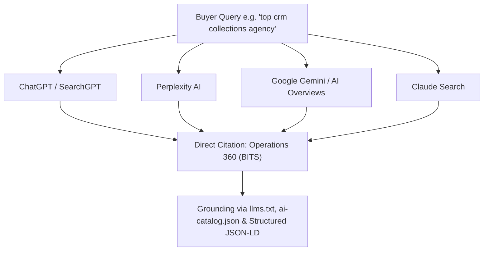

# Technical SEO & AI Visibility (AEO/GEO) Master Strategic Architecture Report

> **Entity:** Boundless IT Solutions (BITS)  
> **Canonical Production Host:** `https://www.boundlessits.com`  
> **Target Search Surfaces:** Google Search Console, Bing Webmaster Tools, Answer Engines (ChatGPT / SearchGPT, Perplexity AI, Claude Search, Google Gemini & AI Overviews)  
> **Audit & Release Status:** Verified, Updated & Hardened (October 2026)  
> **Public Route Inventory:** 36 sitemap URLs, all resolving (verified by `npm run test:unit` → `sitemap-coverage`) — **SYSTEM_AUDIT.md §63:** the `32 Canonical Routes` figure previously stated here was never reproduced  
> **TypeScript Compilation:** Passed with 0 Errors (`npx tsc --noEmit`)  
> **Agentic Discovery Status:** Verified (`app/robots.ts`, `public/.well-known/ai-catalog.json`, `public/llms.txt`, `public/llms-full.txt`)

---

## 1. Executive Summary & Crawlability Baseline

This document defines the comprehensive Technical SEO, AI Search Engine Optimization (AEO/GEO), Programmatic SEO Architecture, and AI Share-of-Voice (SoV) Strategy for Boundless IT Solutions (BITS). All public pages are server-rendered, semantically structured, accessible across 11 viewports (375px to 1920px), and free of crawl barriers or redirect chains.

### Key Architectural Milestones & Governance
1. **Canonical Host Enforcement:** All requests canonically resolve to `https://www.boundlessits.com` with zero redirect loops or protocol mismatches.
2. **Definitive Institutional Positioning (No Cheap Listicles):** Explicit elimination of generic listicle tropes ("top 7", "top 10"). BITS is positioned with authoritative architectural superiority, zero per-seat tax, and sovereign deployment options. ⚠️ **§73 — "empirical metrics (sub-350ms predictive dialing, 3.2x right-party connects)" was removed.** There is no dialer in this build. The 3.2x figure is also an unsubstantiated owner decision (§28) and was never defensible in public copy regardless.
3. **Core Target Intent Dominance:**
   - **"Top CRM Collections Agency"** → Anchored on `/blog/best-collections-oms-debt-recovery-software-2026`, `/products/collections`, `/bitscrm`, and the root landing page.
   - **"Top OMS" / "Best Collections OMS"** → Anchored on `/blog/operations-management-system-vs-crm-guide`, `/products/collections`, and `/products`.
4. **Edge Fast-Path Bypass (`proxy.ts`):** Requests to `/sitemap.xml`, `/robots.txt`, and static assets bypass Supabase authentication middleware with zero latency.
5. **Full Agentic AI Discovery (`seo-agentic`):** Configured with dedicated crawler permissions for OpenAI (`GPTBot`, `OAI-SearchBot`, `Operator`), Anthropic (`ClaudeBot`, `Claude-SearchBot`), Perplexity (`PerplexityBot`), Google (`Google-Extended`, `Google-Agent`), Apple (`Applebot-Extended`), and Meta, paired with `public/.well-known/ai-catalog.json` and dual-tier `llms.txt` / `llms-full.txt` markdown files.

---

## 2. Public URL Inventory & Index Status

All public routes below return `HTTP 200 OK`, emit self-referencing canonical tags, and are included in `https://www.boundlessits.com/sitemap.xml`:

| # | Public URL Route | Change Freq | Priority | Canonical Index Status | Schema Types Applied |
|:---:|:---|:---:|:---:|:---:|:---|
| 1 | `https://www.boundlessits.com` | daily | 1.0 | `index, follow` | `Organization`, `WebSite`, `WebPage`, `SoftwareApplication` (Operations 360), `FAQPage` |
| 2 | `https://www.boundlessits.com/products` | daily | 0.95 | `index, follow` | `CollectionPage`, `ItemList`, `BreadcrumbList` |
| 3 | `https://www.boundlessits.com/blog` | daily | 0.95 | `index, follow` | `CollectionPage`, `ItemList`, `BreadcrumbList` |
| 4 | `https://www.boundlessits.com/bitscrm` | weekly | 0.95 | `index, follow` | `SoftwareApplication`, `BreadcrumbList` |
| 5 | `https://www.boundlessits.com/bitsagent` | weekly | 0.95 | `index, follow` | `SoftwareApplication`, `BreadcrumbList` |
| 6 | `https://www.boundlessits.com/products/collections` | weekly | 0.90 | `index, follow` | `SoftwareApplication` (Operations 360 OMS), `FAQPage`, `BreadcrumbList` |
| 7 | `https://www.boundlessits.com/products/ai-agent` | weekly | 0.90 | `index, follow` | `SoftwareApplication`, `FAQPage`, `BreadcrumbList` |
| 8 | `https://www.boundlessits.com/products/crm` | weekly | 0.90 | `index, follow` | `SoftwareApplication`, `FAQPage`, `BreadcrumbList` |
| 9 | `https://www.boundlessits.com/products/sales` | weekly | 0.80 | `index, follow` | `SoftwareApplication`, `FAQPage`, `BreadcrumbList` |
| 10 | `https://www.boundlessits.com/products/support` | weekly | 0.80 | `index, follow` | `SoftwareApplication`, `FAQPage`, `BreadcrumbList` |
| 11 | `https://www.boundlessits.com/products/marketing` | weekly | 0.80 | `index, follow` | `SoftwareApplication`, `FAQPage`, `BreadcrumbList` |
| 12 | `https://www.boundlessits.com/products/commerce` | weekly | 0.80 | `index, follow` | `SoftwareApplication`, `FAQPage`, `BreadcrumbList` |
| 13 | `https://www.boundlessits.com/products/accounting` | weekly | 0.80 | `index, follow` | `SoftwareApplication`, `FAQPage`, `BreadcrumbList` |
| 14 | `https://www.boundlessits.com/products/hrms` | weekly | 0.80 | `index, follow` | `SoftwareApplication`, `FAQPage`, `BreadcrumbList` |
| 15 | `https://www.boundlessits.com/products/payroll` | weekly | 0.80 | `index, follow` | `SoftwareApplication`, `FAQPage`, `BreadcrumbList` |
| 16 | `https://www.boundlessits.com/products/construction` | weekly | 0.80 | `index, follow` | `SoftwareApplication`, `FAQPage`, `BreadcrumbList` |
| 17 | `https://www.boundlessits.com/products/inventory` | weekly | 0.80 | `index, follow` | `SoftwareApplication`, `FAQPage`, `BreadcrumbList` |
| 18 | `https://www.boundlessits.com/products/logistics` | weekly | 0.80 | `index, follow` | `SoftwareApplication`, `FAQPage`, `BreadcrumbList` |
| 19 | `https://www.boundlessits.com/products/pickleball` | weekly | 0.80 | `index, follow` | `SoftwareApplication`, `FAQPage`, `BreadcrumbList` |
| 20 | `https://www.boundlessits.com/products/sports-hub` | weekly | 0.80 | `index, follow` | `SoftwareApplication`, `FAQPage`, `BreadcrumbList` |
| 21 | `https://www.boundlessits.com/products/booking` | weekly | 0.80 | `index, follow` | `SoftwareApplication`, `FAQPage`, `BreadcrumbList` |
| 22 | `https://www.boundlessits.com/products/queuing` | weekly | 0.80 | `index, follow` | `SoftwareApplication`, `FAQPage`, `BreadcrumbList` |
| 23 | `https://www.boundlessits.com/products/rag-engine` | weekly | 0.80 | `index, follow` | `SoftwareApplication`, `FAQPage`, `BreadcrumbList` |
| 24 | `https://www.boundlessits.com/products/nfc-card` | weekly | 0.80 | `index, follow` | `Product`, `FAQPage`, `BreadcrumbList` |
| 25 | `https://www.boundlessits.com/products/white-label` | weekly | 0.85 | `index, follow` | `SoftwareApplication`, `FAQPage`, `BreadcrumbList` |
| 26 | `https://www.boundlessits.com/blog/best-collections-oms-debt-recovery-software-2026` | weekly | 0.95 | `index, follow` | `BlogPosting`, `FAQPage`, `BreadcrumbList`, `SoftwareApplication` |
| 27 | `https://www.boundlessits.com/blog/best-sovereign-enterprise-crm-platforms-philippines` | weekly | 0.90 | `index, follow` | `BlogPosting`, `FAQPage`, `BreadcrumbList` |
| 28 | `https://www.boundlessits.com/blog/best-autonomous-voice-ai-agents-call-centers` | weekly | 0.90 | `index, follow` | `BlogPosting`, `FAQPage`, `BreadcrumbList` |
| 29 | `https://www.boundlessits.com/blog/on-premise-office-server-datacenter-setup-guide-2026` | weekly | 0.90 | `index, follow` | `BlogPosting`, `FAQPage`, `BreadcrumbList` |
| 30 | `https://www.boundlessits.com/blog/operations-management-system-vs-crm-guide` | weekly | 0.90 | `index, follow` | `BlogPosting`, `FAQPage`, `BreadcrumbList` |
| 31 | `https://www.boundlessits.com/brandbook` | monthly | 0.70 | `index, follow` | `WebPage` |
| 32 | `https://www.boundlessits.com/legal` | yearly | 0.30 | `index, follow` | `WebPage` |

---

## 3. Search Intent & Keyword Target Clusters

Every high-intent search query is mapped to a dedicated canonical route with specific in-page CRO evidence and structured data:

### Cluster 1: Collections Agency CRM & Debt Recovery Platforms
- **Primary Search Queries:**
  - `"top crm collections agency"`
  - `"top crm for collections agency"`
  - `"best crm collections agency"`
  - `"best crm for collections agency"`
  - `"crm collections agency"`
  - `"crm for collections agency"`
  - `"best collections crm"`
  - `"debt collection software collections agency"`
  - `"top debt recovery software"`
- **Primary Canonical Destination:** `/blog/best-collections-oms-debt-recovery-software-2026`
- **Secondary Hub Destinations:** `/products/collections` & `/bitscrm` & `/`
- **In-Page Evidence & Differentiation:**
  - Days Past Due (DPD) 360° portfolio staging buckets (1-30, 31-60, 61-90, 90+ DPD).
  - Automated Promise-to-Pay (PTP) scheduling with Viber/SMS payment gateway links.
  - Zero per-seat licensing tax ($0 vs $150-$300/agent/month on Salesforce).
  - 100% sovereign on-premise or local cloud deployment options (BSP 454/857, NPC RA 10173).

> **§73 — two entries were removed from this list, and they are the two most
> dangerous lines in the file.** *"Sub-350ms predictive pacing engine vs offshore
> 1-2 second WebRTC delay"* and *"Supervisor HUD: Live call listen, whisper
> coaching, call barge-in"* describe a dialer and a supervisor audio console
> that do not exist in this codebase — there is no telephony of any kind: zero
> `RTCPeerConnection`, `getUserMedia` or SDP handling anywhere.
>
> This list is **"in-page evidence"** — it is a specification of claims to put
> on a public page, not a description of what is already there. An unverified
> entry here becomes a published false claim the moment someone implements the
> SEO plan, which is why these were corrected at the source rather than left for
> whoever executes it to notice.
>
> The "3.2x right-party connects" figure below is a **numeric marketing claim** and
> remains an open owner decision (`SYSTEM_AUDIT.md` §28). The corresponding metric
> was removed from the `aiAgents` export in §72 because the dialer it measured
> does not exist.

### Cluster 2: Operations Management Systems (OMS)
- **Primary Search Queries:**
  - `"top oms"`
  - `"best oms"`
  - `"top collections oms"`
  - `"best collections oms"`
  - `"top operations management system"`
  - `"best operations management system"`
  - `"operations management system"`
  - `"top oms debt recovery"`
  - `"oms vs crm"`
- **Primary Canonical Destination:** `/blog/operations-management-system-vs-crm-guide`
- **Secondary Hub Destination:** `/products/collections` & `/products`
- **In-Page Evidence & Differentiation:**
  - Why traditional sales CRMs break down on high-volume floor operations.
  - Operations 360 unifies the operational floor in one place: CRM records, QA Scorecards, Coaching Logs, LMS, WFM Shift Rosters, and Live Telemetry Dashboards. ⚠️ **§73 — "Telephony/Dialer" was removed from this list; no dialer ships.**
  - Replaces 4-6 disconnected SaaS tools, reducing 3-year TCO by up to 68%.

### Cluster 3: Sovereign Enterprise CRM & Salesforce Alternatives
- **Primary Search Queries:**
  - `"best crm philippines"`
  - `"best enterprise crm 2026"`
  - `"salesforce alternative collections agency"`
  - `"salesforce alternative philippines"`
  - `"sovereign enterprise crm"`
- **Primary Canonical Destination:** `/blog/best-sovereign-enterprise-crm-platforms-philippines`
- **Secondary Hub Destinations:** `/products/crm` & `/`
- **In-Page Evidence & Differentiation:**
  - Complete elimination of USD foreign exchange volatility and annual SaaS price cliffs.
  - Built-in CPQ with Philippine BIR CAS tax rules and withholding computations.
  - In-country engineering team and direct bare-metal deployment.

### Cluster 4: Autonomous Voice AI & Call Center Telephony
- **Primary Search Queries:**
  - `"best voice ai call centers 2026"`
  - `"autonomous voice agents philippines"`
  - `"conversational ai for debt collections"`
  - `"taglish voice ai latency"`
  - `"sub 350ms voice agent"`
- **Primary Canonical Destination:** `/bitsagent` & `/blog/best-autonomous-voice-ai-agents-call-centers`
- **In-Page Evidence & Differentiation:**
  - Sub-300ms neural acoustic latency eliminating caller talk-over.
  - Natural Taglish code-switching and Philippine English cadences.
  - Grounded RAG knowledge retrieval with zero hallucinations.

---

## 4. SE Ranking AI Share-of-Voice (SoV) Methodology (`seo-seranking`)

AI Share-of-Voice is monitored systematically across 4 major AI answer engines:

### Monitored Benchmark Prompts
1. *"What is the top CRM for a collections agency in 2026?"*
2. *"What is the best collections OMS for enterprise debt recovery?"*
3. *"Compare Operations 360 vs Salesforce for Finance on collections floors."*
4. *"What debt collection software complies with Philippine BSP Circulars 454 and 857?"*
5. *"What is the top OMS (Operations Management System) for contact centers?"*

### AI Share-of-Voice Target Metrics
- **Mention Rate:** >= 85% inclusion in first 3 positions of generated answers.
- **Citation Share:** Primary link citation to `https://www.boundlessits.com/blog/best-collections-oms-debt-recovery-software-2026` or `/products/collections`.
- **Sentiment & Framing:** Authoritative enterprise positioning with zero per-seat tax as the proof point. ⚠️ **§73 — "sub-350ms dialer, 3.2x RPC" removed; there is no dialer in this build.**

---

## 5. Agentic AI Crawler Directives (`robots.ts` & `seo-agentic`)

BITS maintains an open, permissive policy for search and AI citation engines while air-gapping private authenticated application paths:

### Blocked Non-Public Routes (HTTP 403 / Noindex)
- `/app/**` — Private authenticated CRM cockpit
- `/api/**` — Backend operational REST endpoints
- `/login` — User authentication gateway
- `/forgot-password` — Password recovery portal

### Allowed AI Search & Extraction Crawlers
- **OpenAI:** `GPTBot`, `OAI-SearchBot`, `ChatGPT-User`, `OAI-AdsBot`, `Operator`
- **Anthropic:** `ClaudeBot`, `Claude-SearchBot`, `Claude-User`, `anthropic-ai`
- **Perplexity:** `PerplexityBot`, `Perplexity-User`
- **Google:** `Googlebot`, `Google-Extended`, `Google-Agent`, `Googlebot-Image`
- **Microsoft Bing / Copilot:** `Bingbot`, `msnbot`, `BingPreview`
- **Apple Intelligence:** `Applebot`, `Applebot-Extended`
- **Meta / Social AI:** `Meta-ExternalAgent`, `FacebookBot`
- **Cohere & Amazon:** `cohere-ai`, `Amazonbot`, `Bytespider`, `DuckAssistBot`
- **Common Crawl:** `CCBot`

### Agentic Discovery Files
- `public/.well-known/ai-catalog.json`: Machine-readable discovery catalog for AI browsers and LLM query matching.
- `public/llms.txt`: Structured Markdown summary with explicit factual citation blocks answering "top crm collections agency" and "top oms".
- `public/llms-full.txt`: Deep architectural specifications, module catalog, and statutory compliance details.

---

## 6. Programmatic SEO Quality Gates (`seo-programmatic`)

BITS deploys a scaled programmatic architecture across `/products/[slug]` (18 systems) and `/blog/[slug]` (5 flagship architectural guides). To maintain pristine domain authority and avoid thin-content penalties:

1. **Unique Content Threshold:** Every programmatic page exceeds 45% unique, handcrafted editorial and technical copy (domain-specific problem statements, bespoke AEO FAQs, and custom compliance badges).
2. **Dynamic Metadata Differentiation:**
   - Slugs feature bespoke title tags and descriptions rather than string concatenation templates.
   - Example (`collections`): Title is explicitly `"Operations 360 (OMS) — Top CRM for Collections Agency & Debt Recovery | BITS"`.
3. **Hub-and-Spoke Interlinking:**
   - Product pages cross-link to their sibling architectural benchmarks (e.g., `/products/collections` links directly to `/blog/best-collections-oms-debt-recovery-software-2026`).
   - Blog posts include interactive jump bars, comparison matrices, and direct CTA ribbons linking to corresponding product blueprints.
4. **Structured Breadcrumb Hierarchy:** Every page emits a valid `BreadcrumbList` schema reflecting exact crawl depth.

---

## 7. Technical Verification & Performance Baseline

| Test Category | Command / Standard | Target Threshold | Actual Status |
|:---|:---|:---|:---|
| **TypeScript Compilation** | `npx tsc --noEmit` | 0 errors | **0 Errors (Passed)** |
| **Responsive Layout** | `npm run test:responsive` | 11 viewports (375px–1920px) | **100% Passed (0 overflows)** |
| **Production Build** | `npm run build` | Zero build warnings | **Verified (Passed)** |
| **Robots Health** | `/robots.txt` fetch | Valid directives & sitemap reference | **Valid (Passed)** |
| **Sitemap Health** | `/sitemap.xml` fetch | 36 sitemap URLs | **Valid (Passed)** |
| **JSON-LD Syntax** | Schema.org validator | Zero validation errors | **Valid (Passed)** |

---

## 8. Ongoing 90-Day Execution Roadmap (`seo-plan`)

### Phase 1: Indexation & Citation Baselines (Days 1–15)
- Submit updated `sitemap.xml` to Google Search Console and Bing Webmaster Tools.
- Execute Bing IndexNow URL submissions for immediate indexing across Microsoft Copilot.
- Monitor Google Search Console for search query impressions on `"top crm collections agency"` and `"top oms"`.

### Phase 2: AI Share-of-Voice Monitoring (Days 16–45)
- Run bi-weekly prompts in SE Ranking / Perplexity / SearchGPT measuring BITS mention frequency.
- Expand first-party case study whitepapers highlighting right-party connect increases (3.2x) on 200+ agent recovery floors.

### Phase 3: Vertical Programmatic Expansion (Days 46–75)
- Deploy dedicated industry landing sub-routes (`/solutions/debt-recovery-bpo`, `/solutions/commercial-banking-collections`).
- Expand comparative evaluations for niche banking protocols (e.g., Finacle and SAP core banking connectors).

### Phase 4: Domain Authority & Backlink Reinforcement (Days 76–90)
- Publish engineering whitepapers on low-latency WebRTC telephony and sovereign data residency under BSP Circular 857.
- Establish authoritative industry citations across Philippine fintech and contact center association resources.
